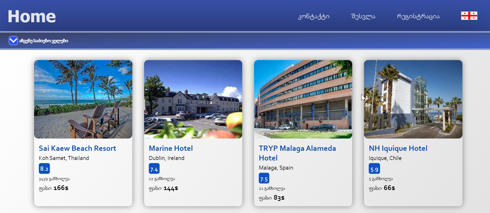
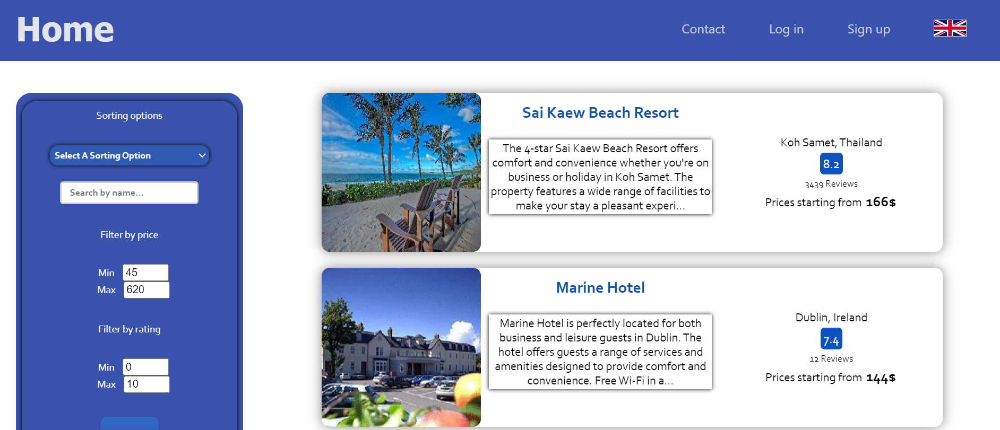
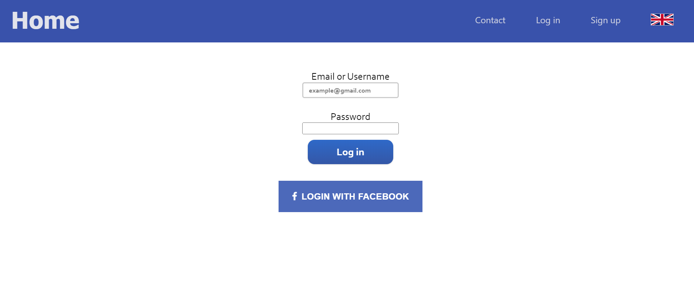
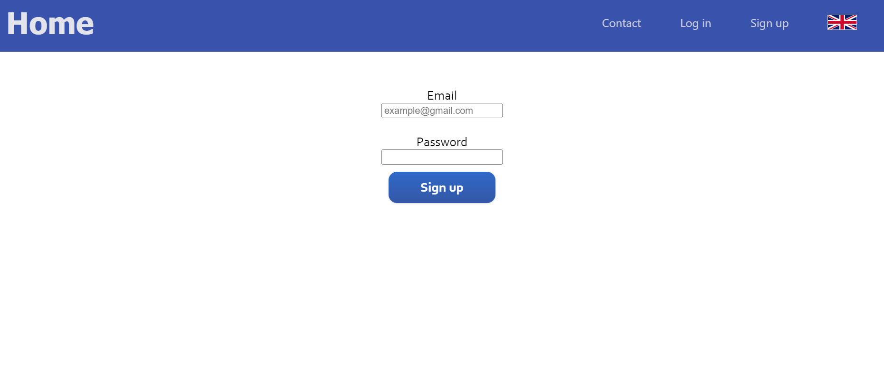
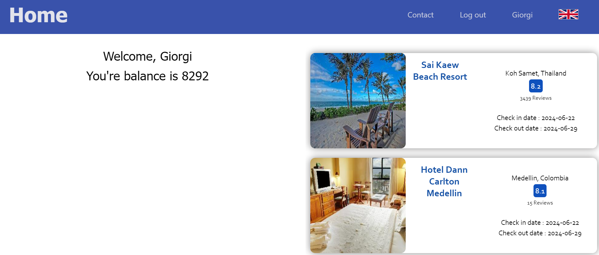
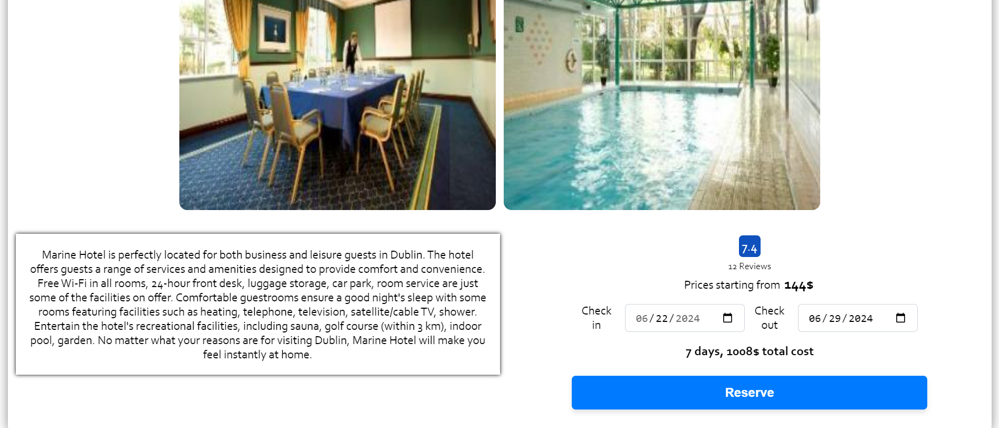
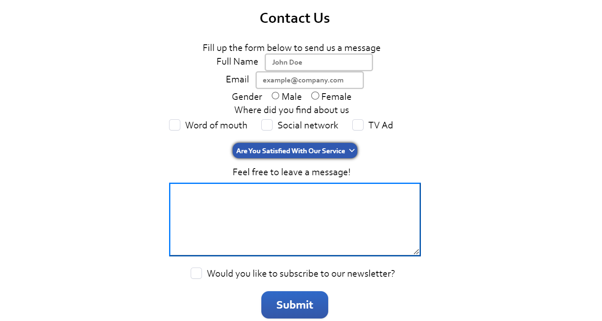

# Hotel Booking WebApp

A fully functional hotel booking website built with **React.js**, featuring intuitive navigation, hotel search and filtering, user accounts, and reservations.

## Features

- **React Routing:** Seamless navigation between pages with a responsive navbar.
- **User Authentication:** Login using sample credentials or Facebook login.
- **Hotel Search & Filter:** Search for hotels, filter by criteria, and sort results (6 sorting options, 3 filters).
- **Reservation System:** Reserve hotels with automatic cost calculation based on user balance.
- **Account Management:** View reservations, manage balance, and register new accounts.
- **Contact Form:** Submit messages via a simple contact page.
- **Multi-language Support:** Switch between languages with a language selector.

## Pages

### Navbar
Provides links to all main pages including Home, Login, Sign Up, Account, and Contact.

### Home Page
Displays a search box and preview cards for hotels.

### Search Results
Filters and sorts hotels based on user input.

### Login
Login with credentials from `accountData.json` or Facebook login.

### Sign Up
Register a new user account.

### Account
View user balance and active reservations.

### Hotel Page
Select check-in/check-out dates and reserve a hotel.

### Contact
Submit messages using the contact form.

## Overview

The website is built entirely in **React.js**, with modular components and state management. Styling is implemented with CSS for a clean, visually appealing interface. All features are functional and designed to provide an optimal user experience.
